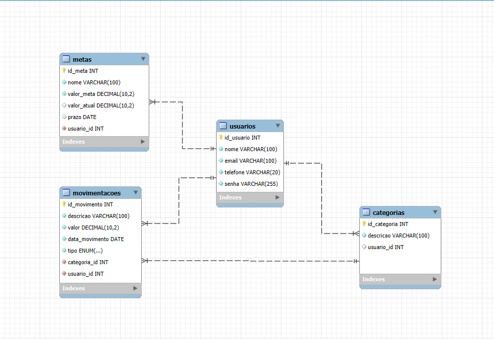

# 💵 SA-FINANÇAS

Finanças pessoais

---

## 📊 Estrutura Organizacional

---

## 🧩 Business Model Canvas
🔗 https://canva.link/4ywbf9q97dq1mel

---

## 🌍 Área de Atuação
Finanças pessoais

---

## ⚠️ Problema
Falta de controle e organização das finanças pessoais. 

---

## 💡 Solução
Sistema de controle financeiro:

- O sistema de finanças pessoais resolve o problema da falta de controle financeiro, ajudando usuários a organizar receitas, despesas, metas e contas, permitindo um melhor planejamento e evitando gastos desnecessários. 

---

## ⚖️ Regras de Negócio

- O e-mail do usuário não pode ser duplicado.
- O valor das receitas deve ser maior que zero.
- O valor de despesas deve ser maior que zero.
- Cada usuário poderá acessar apenas suas próprias informações.
- O saldo será calculado pela diferença entre receitas e despesas.
- Saldo = Receitas − Despesas
- Apenas usuários autenticados poderão acessar o sistema.
- Toda movimentação financeira deve possuir descrição e data.

---

## ⚙️ Requisitos Funcionais

- O sistema deve permitir o cadastro de usuários.
- O sistema deve permitir login de usuários.
- O sistema deve permitir cadastrar receitas financeiras.
- O sistema deve permitir cadastrar despesas financeiras.
- O sistema deve calcular o saldo financeiro do usuário.
- O sistema deve permitir visualizar receitas e despesas cadastradas.
- O sistema deve permitir cadastrar categorias financeiras.
- O sistema deve permitir criar metas financeiras.
- O sistema deve gerar relatórios financeiros.
- O sistema deve armazenar o histórico financeiro do usuário.

---

## 🛡️ Requisitos Não Funcionais

- O sistema deve carregar as informações rapidamente.
- O sistema deve possuir interface simples e fácil de usar.
- O sistema deve estar disponível para acesso sempre que necessário.
- O sistema deve armazenar corretamente os dados financeiros.
- O sistema deve funcionar nos principais navegadores.
- O sistema deve funcionar em computadores e celulares.
- O sistema deve permitir recuperação de dados em caso de falhas.

---

## 📊 Modelagem Lógica Banco
